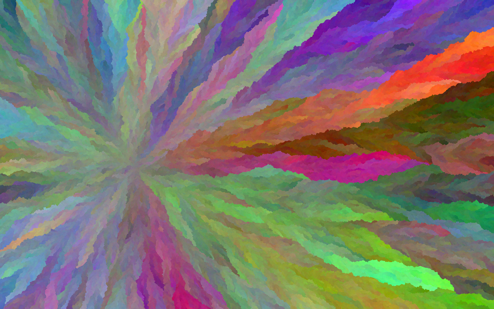
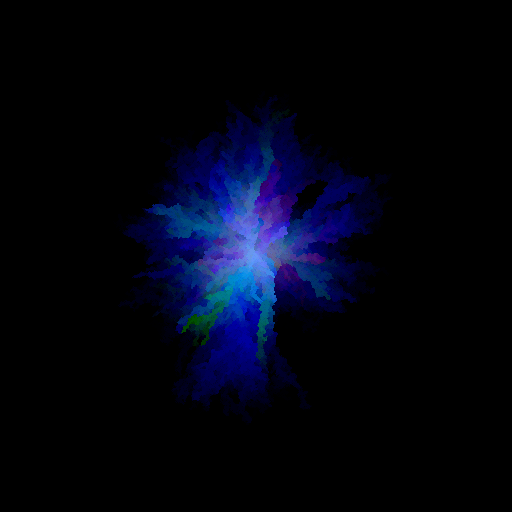
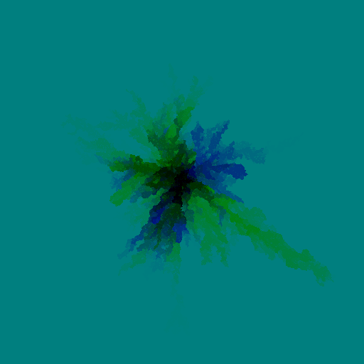
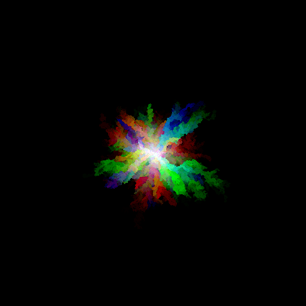
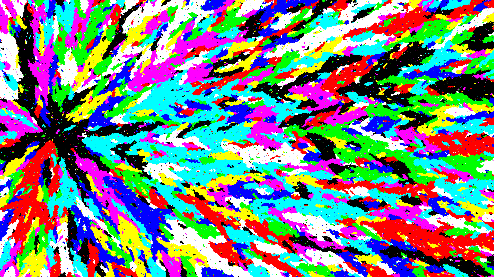
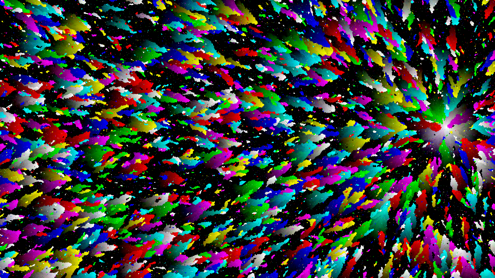
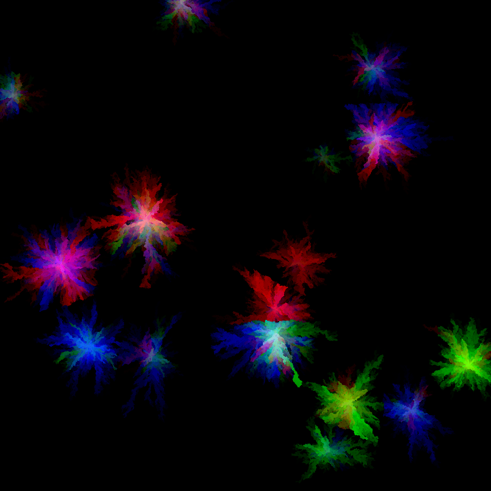

# Colorful Explosions

This program can generate images that kinda look like explosions. You can see examples [here](#examples-of-generated-images). 
Not very useful, but looks nice at least, in my opinion. 

## How to run

Download the [release](https://github.com/irekgab/colorful-explosions/releases/latest) (only windows), or build on your own.

## Parameters

If you want to run the program, you would need a `params.json` file in the same folder with the executable. You can find an example of it in examples folder in the repository.
The names of some parameters in this file might be a bit confusing. So, here are the list of parameters with explanation of what they represent.  

- random_seed - a boolean that represents whether the seed should be randomly piked or not 
- seed - specifies the seed should be used in case when "random_seed" is set to false
- filename - how the final image file should be named 
- width - width of the image in pixels
- height - height of the image in pixels
- num - number of explosions (starting points)
- variety - basically, determines the maximum difference in red, green, blue values of a pixel when propagating from one pixel to another    
- r - an array of length 2, where the first element represents the minimum red value for a pixel, and second value represents the maximum value  
- g - an array of length 2, where the first element represents the minimum green value for a pixel, and second value represents the maximum value
- b - an array of length 2, where the first element represents the minimum blue value for a pixel, and second value represents the maximum value
- random_center_xy - a boolean that represents whether the position of the center of explosion is picked randomly or not
- center_x - the x position of center pixel if "random_center_xy" is set to false
- center_y - the y position of center pixel if "random_center_xy" is set to false
- random_center_col - a boolean that represents whether the color of the center of explosion is picked randomly or not
- center_r - the red value of center pixel if "random_center_col" is set to false 
- center_g - the green value of center pixel if "random_center_col" is set to false
- center_b - the blue value of center pixel if "random_center_col" is set to false
- disruption - the probability of a pixel been "disrupted" (set to a random color regardless of the colors of neighbors)
- r_increase_probability - independent probability of red value to increase when propagating to the next pixel  
- g_increase_probability - independent probability of green value to increase when propagating to the next pixel
- b_increase_probability - independent probability of blue value to increase when propagating to the next pixel
- r_decrease_probability - independent probability of red value to decrease when propagating to the next pixel
- g_decrease_probability - independent probability of green value to decrease when propagating to the next pixel
- b_decrease_probability - independent probability of blue value to decrease when propagating to the next pixel

## Examples of generated images

